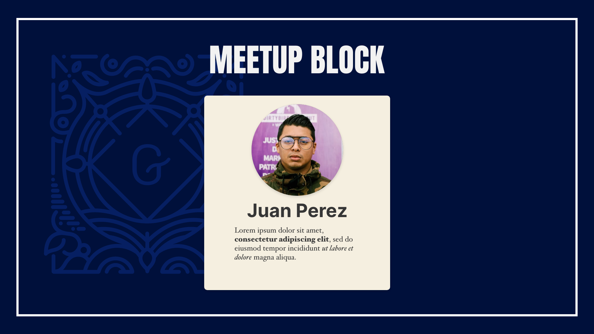

Este proyecto es creado utilizando [Create Guten Block](https://github.com/ahmadawais/create-guten-block).

Abajo verás información de como correr los scripts en tu computadora.
Debes tener instalado NodeJS y una instalación de WordPress, preferiblemente local.

Puedes ver más y conocer más de la guía [aquí](https://github.com/ahmadawais/create-guten-block).

Debes clonar este repositorio dentro de la carpeta plugin de tu instalación de WordPress.

## 👉  `npm start`
- Compila el código JS y espera para cualquier cambio.
- Activa el plugin en el dashboard de WordPress, esto sólo debes hacerlo una sola vez.
- Si necesitas ver el cambio en tu editor de Gutenberg debes recargar el sitio manualmente.
- Si no vez el bloque en el editor después de hacer cambios revisa la consola del navegador para ver si no hay errores.

## 👉  `npm run build`
- Hace la construcción del código lista para producción dentro de la carpeta `dist`.

---

###### Cualquier consulta a la orden 👋 escribeme en mi sitio web [MoiTorrijos.com](https://moitorrijos.com/)